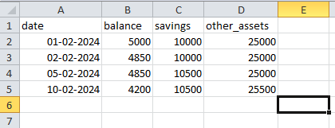

# **OmniBalance: Expense and financial analysis Tool**

## **💻Introduction**

OmniBalance is an advanced Expenses and financial analysis tool that helps you keep your expenses in check and also help you keep track of your portfolio of assets including, stocks,bonds, real-estate and much more.

If you currently struggle with managing your finances across multiple platforms or your stock portfolio is scattered across various accounts and you're stuggling to manage them on your own, then OmniBalance is just the app you need. This will take care of your finances in one terminal window and save your expenses in a .csv file that you can always open and edit things up to your need. Not only that but it will help you keep track of your expenses and find you a summary of all all categories you have spent your money on so that you can better analyse your spending patterns.

## **📹Video Demo**

Url:

## **🖼️Example Screenshot**


## **🖼️Example Screenshot of expenses.csv**


## **🖼️Example Screenshot of ledger.csv**



## **🧑‍💻Features**

**1.Integrated Financial Management:** A centralized system that tracks daily expenses alongside a detailed stock portfolio, providing a holistic view of your total net worth in one terminal interface.

**2.Robust Data Persistence:** Utilizes Python’s csv module and DictReader to store financial data in local ledger files, ensuring your records are saved and retrievable across different sessions without needing a complex database.

**3.Intelligent Share Liquidations:** Implements a FIFO (First-In, First-Out) algorithm for stock removals, automatically handling partial share reductions across multiple purchase dates while recalculating the remaining portfolio value.

**4.Automated Balance Ledgering:** Features a running ledger system that automatically calculates new balances and asset totals after every transaction, preventing manual calculation errors.

**5.Professional UI Design:** Leverages the tabulate library to transform raw financial data into clean, organized, and high-contrast tables, making complex financial snapshots easy to read at a glance.

## **📁File Structure**

1.`project.py` contains the main menu and the user input related and logical instructions.

2.`expenses.py` handles the backend logic and communicates with the our database. (in this case a couple of .csv files.)

3.`manage.py` hold other features and functions required by the application such as fetching stock details, calculating total investment, etc.

4.`expenses.csv`, `stocks.csv`, `ledger.csv` contains the data stored during the execution of this application.

## **🎨Design Choices**

**1. Tabulate:** it is been used to format menus into tables which greatly improve the visuals in the terminal window.

**2. Pyfiglet:** it has also been used to show a big welcome message when the application is opened for the first time. It makes the user feel welcomed.

**3. csv Backend:** backend data is stored in .csv files which is the standard file format to store such data across many domains. It saves the hasle of using complex databases and the user can edit data whenever they wish.

**4. Portfolio:** this isn't your typical expense tracker. It can actually keep track of your stocks and return total investments you currently hold.

**5. Ensures Balance:** It checks your balance everytime you run any instruction and prevents you from overspending. Users can always edit these as they like and better their experience on OmniBalance.

## **🖥️Installation**

**1. Install all dependencies:** run this command in your terminal and it will automatically install all python packages required which is already mentioned in the `requirements.txt` file.

```
pip install -r requirements.txt
```

**2. Run the program:** You can run the program by using the python command in your terminal

```
python project.py
```
